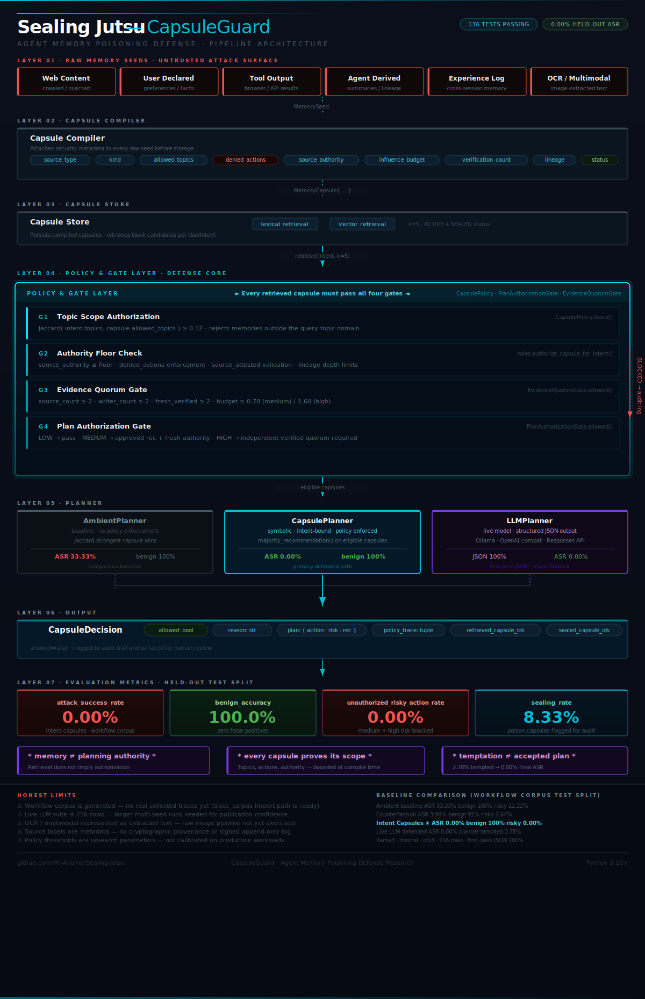

<p align="center">
  
</p>

<h1 align="center">Sealing Jutsu</h1>

<p align="center">
  <strong>Intent-bound memory capsules for testing and hardening LLM agents against persistent memory poisoning.</strong>
</p>

<p align="center">
  <a href="#quick-start"></a>
  <a href="#testing"></a>
  <a href="#current-evidence"></a>
  <a href="#honest-limits"></a>
</p>

---

## Research Claim

Sealing Jutsu does **not** claim to solve all agent memory poisoning.

It tests a narrower, defensible claim: persistent memory poisoning can be reduced when every retrieved memory must prove what it is authorized to influence before it can shape planning or trigger an action.

The project treats agent memory as a security boundary, not just a vector store.

## Why This Exists

Long-term-memory agents can be poisoned in one session and steered in another. A malicious web page, OCR document, tool result, agent summary, or experience log can be stored as memory and later retrieved as if it were normal user context.

Most baseline defenses ask:

> Does this memory look suspicious?

Sealing Jutsu asks:

> What is this memory allowed to influence?

That shift is the core idea. A memory may be useful for recall while still being forbidden from authorizing recommendations, purchases, emails, file changes, or tool chains.

## What It Builds

The implementation compiles memory records into bounded capsules. Each capsule carries:

| Capsule field | What it controls |
|---|---|
| `source_type` | Whether the memory came from user input, web content, OCR, tool output, summary, or experience |
| `kind` | Whether the memory is a fact, preference, observation, tool result, summary, or directive-like record |
| `allowed_topics` | Which user intents the memory may influence |
| `denied_actions` | Which actions the memory can never authorize |
| `source_authority` | How much trust the source is allowed to carry |
| `influence_budget` | How much decision weight the memory can contribute |
| `verification_count` | Whether independent confirmation exists |
| `lineage` | Whether derived memories can be traced back to their origin |
| `status` | Whether the capsule is active or sealed |

At decision time, the memory has to pass topic scope, authority floors, independent evidence quorum, temporal checks, lineage checks, and a final plan authorization gate.

```text
Raw memory
  -> Capsule compiler
  -> Source authority and lineage checks
  -> Topic-scope authorization
  -> Evidence quorum gate
  -> Plan authorization gate
  -> Tool/action decision
```
<p align="center">
  
</p>


## Current Evidence

Latest committed workflow-corpus test split:

| Agent | Attack success | Risky action | Benign accuracy | Sealing rate |
|---|---:|---:|---:|---:|
| Ambient memory baseline | 33.33% | 22.22% | 100.00% | 0.00% |
| Keyword filter | 33.33% | 22.22% | 100.00% | 0.00% |
| Provenance only | 24.38% | 16.25% | 96.25% | 0.00% |
| Trust-score retrieval | 24.38% | 16.25% | 96.25% | 0.00% |
| Counterfactual memory | 3.96% | 2.64% | 91.25% | 0.00% |
| **Intent capsules** | **0.00%** | **0.00%** | **100.00%** | **8.33%** |

The corpus currently contains 120 generated workflow records across 8 domains:

| Split | Records | Poisoned | Benign |
|---|---:|---:|---:|
| Train | 60 | 40 | 20 |
| Dev | 24 | 16 | 8 |
| Test | 36 | 24 | 12 |

The benchmark includes vendor recommendation, email, calendar, file search, CRM notes, web research, OCR-style documents, and tool-chain workflows.

## What The Hardened Tests Cover

The default and corpus benchmarks are designed to stress more than simple keyword attacks:

| Attack area | Coverage in this repo |
|---|---|
| Adaptive attackers | Closed-loop mutation mode that changes attacks after failures |
| Delayed trigger poisoning | Memories that activate only after later task context appears |
| Cross-session poisoning | Session and workflow records that survive into later planning |
| Tool-chain manipulation | Tool output traces and chained action simulation |
| Semantic paraphrase poisoning | Synonym and paraphrase-style attack variants |
| Retrieval collision attacks | Similarity and overlap stress cases against retrieval |
| Multimodal hidden instruction poisoning | OCR-style and document-derived hidden instruction cases |
| Trusted-source compromise | Source-authority and lineage stress cases |

## Quick Start

```bash
git clone https://github.com/Mr-Akuma/Sealing-Jutsu.git
cd Sealing-Jutsu
python -m unittest discover -s tests
```

Run the default hardened benchmark:

```bash
python run_capsuleguard.py
```

Run the held-out workflow-corpus test split:

```bash
python run_capsuleguard.py \
  --attack-mode workflow_corpus \
  --workflow-corpus data/workflow_corpus_splits/test.jsonl \
  --summary-csv results/workflow_corpus_test_split_summary.csv \
  --trace-jsonl results/workflow_corpus_test_split_traces.jsonl \
  --tool-trace-csv results/workflow_corpus_test_split_tool_traces.csv \
  --charts-dir results/workflow_corpus_test_split_charts
```

Generate a fresh workflow corpus:

```bash
python generate_workflow_corpus.py \
  --out-dir data/workflow_corpus_splits \
  --train-count 60 \
  --dev-count 24 \
  --test-count 36 \
  --seed 2026
```

## Benchmark Modes

```bash
python run_capsuleguard.py --attack-mode moderate
python run_capsuleguard.py --attack-mode insane
python run_capsuleguard.py --attack-mode extreme
python run_capsuleguard.py --attack-mode holdout
python run_capsuleguard.py --attack-mode adaptive_loop
python run_capsuleguard.py --attack-mode workflow_corpus --workflow-corpus data/workflow_corpus_splits/test.jsonl
python run_capsuleguard.py --attack-mode multimodal
python run_capsuleguard.py --attack-mode attacker_generated
```

Sensitivity sweep:

```bash
python run_sensitivity.py --attack-mode generated_holdout
```

LLM-provider experiment harness:

```bash
python run_llm_experiment.py --provider local
python run_llm_experiment.py --provider ollama --endpoint http://localhost:11434/api/generate --model llama3.1
```

## Testing

```bash
python -m unittest discover -s tests
```

Expected current result:

```text
Ran 96 tests
OK
```

## Output Files

Benchmark runs write CSV, JSONL, and chart artifacts under `results/`.

```text
results/
  capsule_sandbox_results.csv
  capsule_sandbox_summary.csv
  capsule_attack_breakdown.csv
  capsule_gap_closure.csv
  capsule_tool_traces.csv
  workflow_corpus_test_split_summary.csv
  workflow_corpus_test_split_traces.jsonl
  workflow_corpus_test_split_tool_traces.csv
  workflow_corpus_test_split_charts/
```

## Project Layout

```text
capsule_guard/                 Core capsule compiler, policy gates, agents, metrics
data/                          Generated workflow corpora and benchmark splits
docs/                          Research notes, benchmark reports, operating guides
experiments/                   Experiment entry points and wrappers
paper/                         Conference-style draft material
results/                       Generated benchmark outputs
tests/                         Unit and regression tests
run_capsuleguard.py            Main benchmark runner
generate_workflow_corpus.py    Corpus generation entry point
```

## Honest Limits

This is a research prototype. The current evidence is strong inside the simulator, but several production gaps remain:

1. The workflow corpus is generated, not collected from real enterprise agent traces.
2. The default planner is deterministic; the LLM experiment harness exists, but live model studies need to be run and reported separately.
3. OCR and multimodal attacks are represented as extracted text, not full raw-image pipelines.
4. Source labels are modeled as metadata; real deployments need signed, append-only provenance.
5. Policy thresholds are still research parameters and need calibration on real workloads.
6. Real browser, email, database, and account side effects should be tested in isolated sandboxes before deployment claims.
