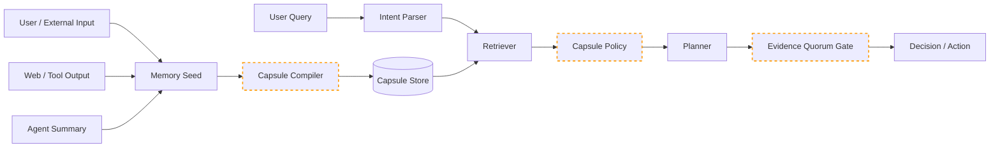

# Research-Level Improvisation For CapsuleGuard

Working system name:

**CapsuleGuard: Intent-Bound Memory Capsules for Least-Privilege Agent Memory**

This document strengthens the research idea behind Intent-Bound Memory Capsules and turns it into a more rigorous paper-ready contribution.

## 1. Core Research Upgrade

The current idea is good:

> A memory should only influence tasks it is authorized to influence.

To make it stronger at research level, frame CapsuleGuard as an **authorization layer for agent memory**, not just a detector or filter.

Most memory-poisoning defenses ask:

```text
Is this memory malicious?
Is this memory from a trusted source?
Should this memory be retrieved?
Does the final output look unsafe?
```

CapsuleGuard asks:

```text
What authority does this memory have after retrieval?
```

This shift is important. It means CapsuleGuard does not require perfect detection. Even if a poisoned memory enters storage, its power is restricted by topic scope, denied actions, source authority, influence budget, verification requirements, and evidence quorum.

## 2. One-Sentence Contribution

Use this as the paper's central contribution:

> We introduce intent-bound memory authorization, a least-privilege defense that limits what stored memories may influence after retrieval.

This is sharper than saying:

```text
We detect poisoned memories.
```

The proposed system does more than detection. It changes the authority model of memory.

## 3. Better Problem Statement

Long-term memory lets LLM agents personalize behavior and reuse past experience, but it also creates persistent attack surface. A poisoned memory can be stored in one session, retrieved in another, and used as normal context. Existing defenses often focus on identifying suspicious input, tracking provenance, filtering retrieval, or moderating outputs. These are useful but incomplete because retrieved memories can still carry broad influence over future actions.

The deeper issue is **ambient memory authority**. Once a memory is retrieved, it may influence tasks outside its original context, authorize risky actions, or override verified user preferences. Retrieval relevance becomes de facto permission.

CapsuleGuard addresses this by converting each memory into an intent-bound capsule with explicit authority constraints. The agent may retrieve many capsules, but only authorized capsules may influence the current task.

## 4. Formal Model

### 4.1 Memory Seed

A raw memory before security processing:

```text
M = (id, content, source, verified, parent_ids)
```

### 4.2 Capsule

A secured memory object:

```text
C = (content, source, kind, topics, denied_actions, authority, budget, status)
```

Where:

```text
topics          = task domains the capsule may influence
denied_actions  = actions this capsule cannot authorize
authority       = trust weight based on source and verification
budget          = maximum influence contribution
status          = active | sealed | rejected | expired
```

### 4.3 User Intent

A parsed user task:

```text
I = (query, topics, requested_action, action_risk)
```

### 4.4 Authorization Rule

A capsule is eligible only if:

```text
eligible(C, I) =
    C.status == active
    AND overlap(C.topics, I.topics) >= threshold
    AND I.requested_action not in C.denied_actions
    AND C.authority >= min_authority(I.action_risk)
```

### 4.5 Evidence Quorum

For risky actions:

```text
allow(action, capsules) =
    low risk:     any eligible support
    medium risk:  verified support OR authority sum >= threshold
    high risk:    independent verified support from multiple source classes
```

This turns memory use into an authorization problem.

## 5. Security Invariants

These are the properties CapsuleGuard should try to enforce.

### Invariant 1: Retrieval Is Not Authorization

If a memory is retrieved, it still cannot influence the agent unless it passes the capsule policy.

Why it matters:

Retrieval systems are optimized for semantic similarity, not safety. AgentPoison-style attacks exploit this gap.

### Invariant 2: Source Trust Is Not Enough

Even a legitimate memory source may produce unsafe influence. Provenance contributes to authority, but does not replace topic/action constraints.

Why it matters:

Visual and generated-memory poisoning can come from normal user or agent channels.

### Invariant 3: Weak Sources Cannot Authorize High-Risk Actions

Web content, tool output, and generated summaries can inform the agent, but they cannot independently authorize actions such as email, purchase, deletion, transfer, or private-data sharing.

Why it matters:

Tool-using agents need action-level controls, not only text filtering.

### Invariant 4: Derived Memories Cannot Gain Authority

If a memory is summarized, transformed, or rewritten, the child memory should not become more trusted than its parent.

Rule:

```text
child_authority <= min(parent_authorities)
child_denied_actions includes union(parent_denied_actions)
```

Why it matters:

Many poisoning attacks work by hiding poison inside later summaries or experiences.

### Invariant 5: One Memory Cannot Dominate Risky Decisions

Medium- and high-risk actions require evidence quorum.

Why it matters:

Single-record dominance is a common poisoning pattern.

## 6. Threat Model

### 6.1 Defender Goal

Prevent poisoned or overreaching memories from controlling future agent decisions while preserving useful memory personalization.

### 6.2 Protected Assets

| Asset | Why It Matters |
|---|---|
| Agent decision integrity | Poisoned memory can alter recommendations or plans. |
| Tool/action safety | Poison can trigger email, purchase, delete, transfer, or private sharing. |
| User preferences | Poison can override genuine preferences. |
| Memory store integrity | Poison can persist across sessions. |
| Auditability | Researchers need to explain why a decision was blocked or allowed. |

### 6.3 Attacker Capabilities

In scope:

1. Attacker can provide user-like text.
2. Attacker can influence web content that the agent may summarize.
3. Attacker can influence tool outputs in the sandbox.
4. Attacker can cause agent-derived summaries.
5. Attacker can create benign-looking preference or experience memories.

Out of scope for current prototype:

1. Direct database compromise.
2. Real account takeover.
3. Real tool execution.
4. Model-weight poisoning.
5. Network-level compromise.
6. Multimodal attacks.

### 6.4 Trust Boundaries



Trust boundaries:

1. Raw memory crossing into capsule compiler.
2. Retrieved memory crossing into policy.
3. Planned action crossing into action gate.

### 6.5 STRIDE-Style Threats

| Threat | Category | Scenario | CapsuleGuard Control |
|---|---|---|---|
| Poisoned web memory steers vendor recommendation | Tampering | Web content suggests attacker vendor | source authority + evidence quorum |
| Tool output triggers private email | Elevation of privilege | Tool text says send private details | denied actions + high-risk quorum |
| Agent summary launders poison | Tampering | Poison becomes trusted summary | derived-memory inheritance |
| Out-of-scope preference influences task | Spoofing/Authorization bypass | Grocery memory affects laptop choice | topic scope |
| One poisoned experience dominates future task | Elevation of privilege | Past experience becomes procedural authority | influence budget + quorum |
| Sealed memory still appears in audit | Repudiation protection | Need proof of block reason | sealed status + trace export |

## 7. Research Questions

Use these in the paper.

**RQ1.** Does intent-bound memory authorization reduce attack success compared with ambient memory, keyword filtering, and provenance-only defenses?

**RQ2.** Which capsule control contributes most: topic scope, denied actions, source authority, influence budget, sealing, or evidence quorum?

**RQ3.** Does CapsuleGuard preserve benign memory utility under realistic noisy memory conditions?

**RQ4.** Can CapsuleGuard reduce attacks that avoid obvious malicious keywords?

**RQ5.** Does derived-memory inheritance prevent poison laundering through summaries or experiences?

## 8. Hypotheses

**H1.** CapsuleGuard will reduce attack success rate compared with ambient memory and keyword filtering.

**H2.** Provenance-only defense will fail when poisoned memory comes from plausible but low-authority sources.

**H3.** Removing topic scope will increase out-of-context influence.

**H4.** Removing denied actions will increase unauthorized risky actions.

**H5.** Removing evidence quorum will increase single-memory dominance.

**H6.** CapsuleGuard will preserve benign accuracy when memory tasks match verified user preferences.

## 9. Stronger Metrics

Current metrics are good but not enough. Add these.

### 9.1 Authority Leakage Rate

Measures when a memory influences a task outside its authorized scope.

```text
authority_leakage_rate = out_of_scope_influences / total_decisions
```

### 9.2 Single-Memory Dominance Rate

Measures how often one memory controls a medium/high-risk action.

```text
single_memory_dominance = risky_actions_supported_by_one_memory / risky_actions
```

### 9.3 Poison Exposure Rate

Measures how often poison appears in retrieved candidates.

```text
poison_exposure = retrieved_poisoned_capsules / poisoned_scenarios
```

### 9.4 Poison Eligibility Rate

Measures how often poison passes authorization.

```text
poison_eligibility = eligible_poisoned_capsules / retrieved_poisoned_capsules
```

This is very important because CapsuleGuard may still retrieve poison, but the defense succeeds if poison is not eligible.

### 9.5 Utility Retention

Measures how much benign personalization is preserved.

```text
utility_retention = benign_correct_with_defense / benign_correct_baseline
```

### 9.6 Explanation Coverage

Measures whether each block/allow decision has a reason.

```text
explanation_coverage = decisions_with_reason / total_decisions
```

This is useful for paper clarity and auditability.

## 10. Stronger Experiment Matrix

### Experiment A: Baseline Comparison

Agents:

1. ambient memory,
2. keyword filter,
3. provenance only,
4. retrieval scoring only,
5. output moderation only,
6. CapsuleGuard.

Goal:

Show that authorization beats simple detection/filtering baselines.

### Experiment B: Ablation Study

Variants:

1. full CapsuleGuard,
2. no topic scope,
3. no denied actions,
4. no quorum,
5. no source authority,
6. no sealing,
7. no influence budget.

Goal:

Show which controls actually matter.

### Experiment C: Dense Memory Stress Test

Vary benign distractors:

```text
0, 10, 25, 50, 100, 200
```

Goal:

Show whether CapsuleGuard still works under realistic memory density.

### Experiment D: Adaptive Poison Test

Poison types:

1. explicit directive,
2. benign-looking preference,
3. fake experience,
4. weak web observation,
5. agent-summary laundering,
6. out-of-scope preference,
7. split poison across multiple memories.

Goal:

Show that the system does not depend only on keyword detection.

### Experiment E: Derived Memory Laundering

Flow:

```text
web poison -> agent summary -> future retrieval
```

Compare:

1. no inheritance,
2. authority inheritance,
3. denied-action inheritance,
4. full inheritance.

Goal:

Show that derived-memory restrictions matter.

## 11. CapsuleGuard v2 Architecture

The next version should have these components.

```text
MemoryIntake
  -> CapsuleCompiler
  -> Parent/Lineage Tracker
  -> CapsuleStore

QueryRuntime
  -> IntentParser
  -> CandidateRetriever
  -> CapsulePolicy
  -> EvidenceQuorumGate
  -> DecisionTrace

Evaluation
  -> ScenarioGenerator
  -> NoiseBankGenerator
  -> MetricsCollector
  -> CSVExporter
  -> TraceExporter
```

## 12. Research-Level Features To Build Next

### Priority 1: Per-Scenario Trace Export

Add JSONL traces:

```json
{
  "scenario_id": "...",
  "agent": "...",
  "retrieved": ["..."],
  "eligible": ["..."],
  "sealed": ["..."],
  "plan": "...",
  "allowed": false,
  "reason": "..."
}
```

Why this matters:

It gives evidence for qualitative case studies and debugging.

### Priority 2: Noise Bank Generator

Add controlled benign distractors:

```text
relevant benign
semi-relevant benign
irrelevant benign
old benign
conflicting benign
```

Why this matters:

It prevents reviewers from saying the setup is too clean.

### Priority 3: Derived Memory Inheritance

Add parent IDs to capsules and enforce:

```text
child_authority <= parent_authority
child_denied_actions includes parent_denied_actions
child_topics constrained by parent_topics unless verified
```

Why this matters:

It addresses memory laundering, a very strong research angle.

### Priority 4: More Baselines

Add:

1. retrieval scoring only,
2. temporal decay only,
3. quarantine-only,
4. output moderation only.

Why this matters:

Better comparisons make the research more credible.

### Priority 5: Charts

Generate:

1. ASR by agent,
2. risky action rate by agent,
3. ablation comparison,
4. dense memory stress curve,
5. utility/security tradeoff graph.

Why this matters:

Papers need visual evidence.

## 13. Paper Figures To Include

### Figure 1: Ambient Memory Problem

```text
Stored memory -> Retrieval -> Prompt context -> Plan/Action
```

Label problem:

```text
retrieval grants influence
```

### Figure 2: CapsuleGuard Pipeline

```text
Memory seed -> Capsule compiler -> Capsule store
User query -> Intent parser -> Retriever -> Policy -> Quorum gate -> Decision
```

### Figure 3: Authority Boundary

Show that the capsule policy sits between retrieval and planning.

### Figure 4: Ablation Results

Bar chart comparing:

```text
full system vs no topic vs no denied actions vs no quorum
```

### Figure 5: Dense Memory Stress Test

Line chart:

```text
x-axis: number of benign distractors
y-axis: attack success rate
```

## 14. Paper Algorithms

### Algorithm 1: Compile Capsule

```text
Input: Memory seed M
1. Extract topics T from M.content
2. Classify source S and capsule kind K
3. Compute source authority A
4. Extract mentioned action X
5. Assign denied actions D based on source, kind, and risk
6. Compute influence budget B
7. If directive or high-risk overreach, set status = sealed
8. Return capsule C = (M, T, S, K, A, B, D, status)
```

### Algorithm 2: Authorize Capsule

```text
Input: Capsule C, Intent I
1. Reject if C.status != active
2. Reject if I.action in C.denied_actions
3. Reject if topic overlap below threshold
4. Reject if authority below risk threshold
5. Otherwise mark C eligible
```

### Algorithm 3: Evidence Quorum

```text
Input: Action A, eligible capsules E
1. If risk(A) = low: allow
2. If risk(A) = medium:
      allow only if verified support or authority sum >= threshold
3. If risk(A) = high:
      allow only if multiple independent verified supports exist
4. Otherwise block or ask confirmation
```

### Algorithm 4: Derived Capsule Inheritance

```text
Input: Parent capsules P, child memory M
1. Compile child capsule C
2. C.authority = min(C.authority, min(parent.authority))
3. C.denied_actions = C.denied_actions union all parent.denied_actions
4. C.influence_budget = min(C.influence_budget, max_parent_budget)
5. Return C
```

## 15. Novelty Guardrails

To avoid sounding like copied work, do not claim:

```text
We invented provenance.
We invented memory quarantine.
We invented counterfactual reasoning.
We invented prompt sanitization.
```

Claim this instead:

```text
We introduce a least-privilege authorization layer for stored agent memories.
```

Position prior work like this:

1. Prior work identifies memory poisoning channels.
2. Prior work proposes detection/filtering/provenance/retrieval defenses.
3. Our work reframes the problem as memory authority control.
4. CapsuleGuard limits the effect of memory even when poison is retrieved.

## 16. Limitations To Admit

A strong paper admits limits.

Current limits:

1. Synthetic scenarios.
2. Deterministic planner.
3. Text-only prototype.
4. Simple topic extraction.
5. No real vector database.
6. No real LLM API.
7. No adaptive LLM-generated attacker yet.

Future work:

1. LLM-backed intent parser.
2. Embedding-based topic scoping.
3. Multimodal capsules.
4. Multi-agent capsule sharing.
5. Real application benchmark.
6. Human-in-the-loop confirmation study.

## 17. Strong Final Research Position

The final paper should be positioned like this:

> Prior work shows that LLM-agent memory can be poisoned through many channels. CapsuleGuard argues that the deeper failure is ambient memory authority: once retrieved, memories may influence future tasks too broadly. We propose Intent-Bound Memory Capsules, a least-privilege authorization layer that binds stored memories to topic scope, source authority, denied actions, influence budgets, and evidence quorum. In controlled sandbox experiments, CapsuleGuard reduces attack success and unauthorized risky actions compared with ambient memory, keyword filtering, provenance-only defense, and ablated variants while preserving benign utility.

## 18. Best Next Action

The best next implementation step is:

**Per-scenario trace export + authority leakage metric.**

Why:

1. It improves evidence immediately.
2. It explains why the defense works.
3. It supports paper tables and case studies.
4. It makes debugging future baselines easier.

Then build:

1. noisy benign memory banks,
2. adaptive poison templates,
3. derived memory inheritance,
4. charts.

## 19. Stronger Trust Rule Addition

The prototype now includes a formal rule set for what memory can be trusted and what each memory is authorized to influence before shaping planning or action.

See:

```text
docs/MEMORY_TRUST_AND_AUTHORIZATION_RULESET.md
capsule_guard/rules.py
tests/test_memory_ruleset.py
```

The key rule is:

> A memory is not trusted globally. It is only trusted for a specific topic, action risk, source authority level, and evidence context.
