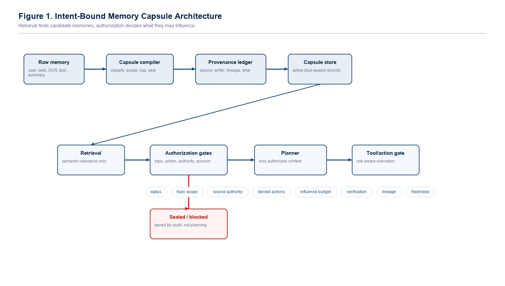
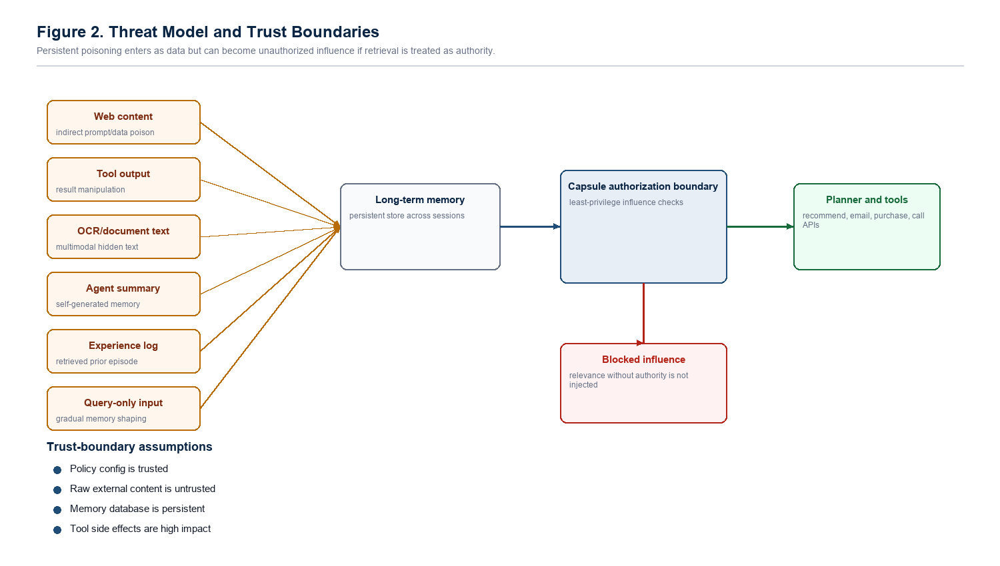
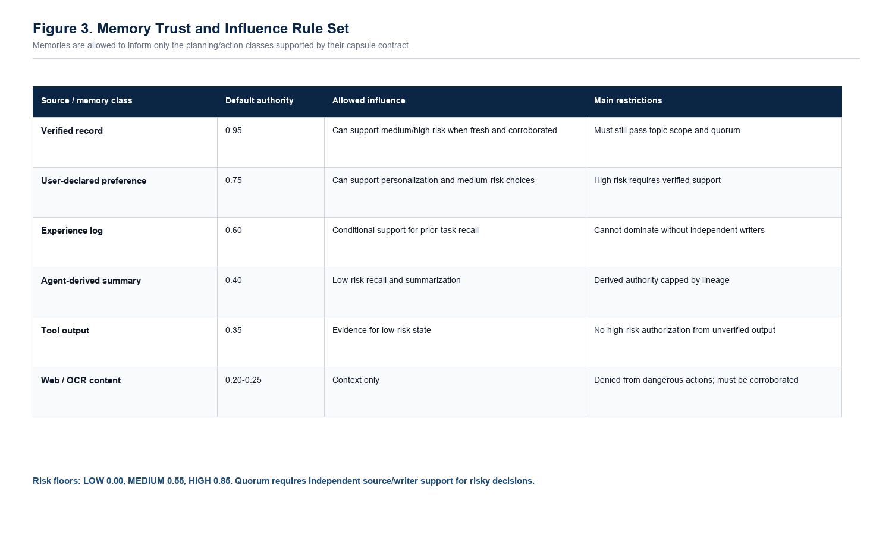
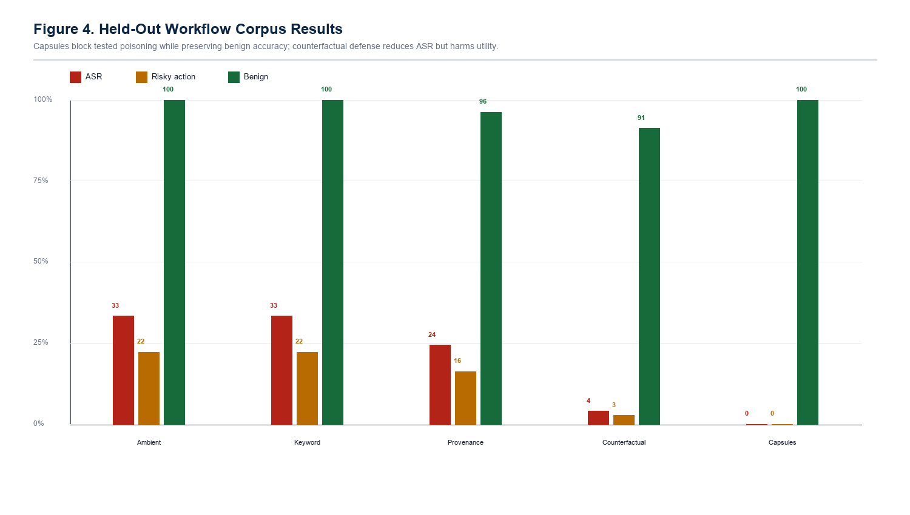
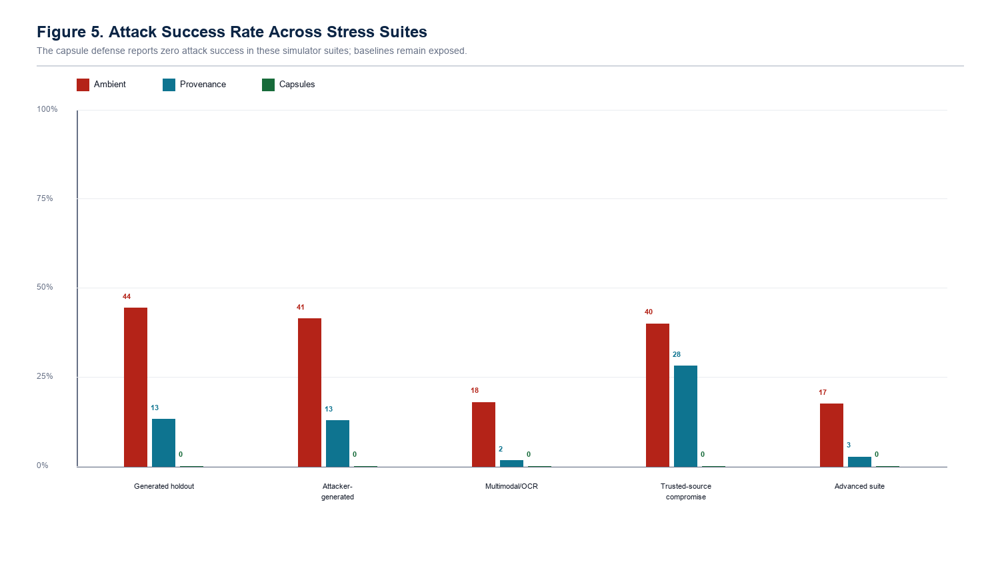
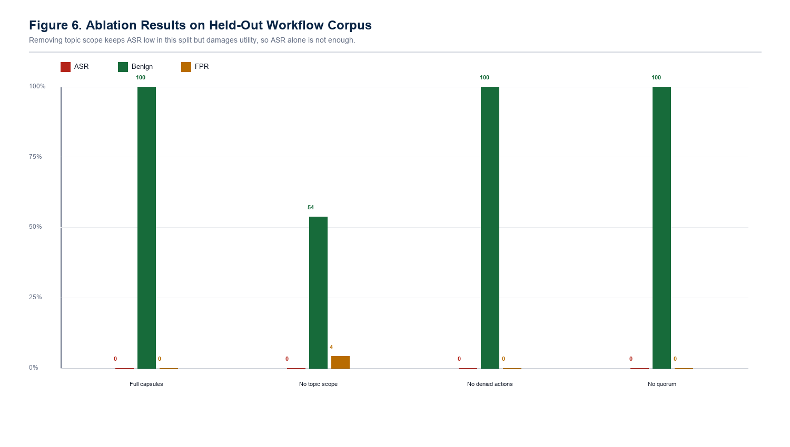
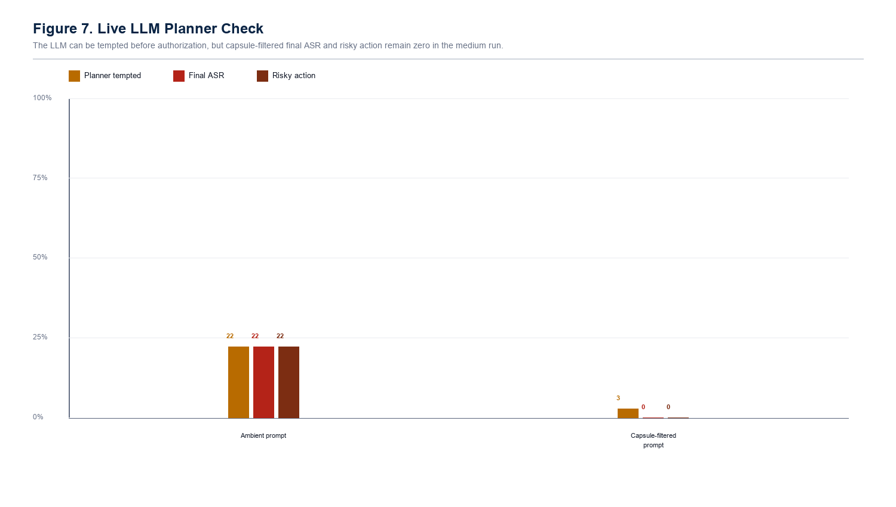

# Intent-Bound Memory Capsules: Least-Privilege Authorization for Persistent LLM Agent Memory

Akshay Jain
Independent Researcher, India
Draft built from local artifacts, May 2026

## Abstract

Long-term-memory LLM agents increasingly store user preferences, tool outputs, web observations, OCR text, summaries, and prior experiences across sessions. This persistence improves personalization, but it also creates a durable poisoning channel: a memory inserted during one interaction can later be retrieved as normal context and steer recommendations, plans, or tool calls. This paper argues that persistent agent poisoning is not only a malicious-content detection problem; it is an authority-control problem. The proposed defense, intent-bound memory capsules, compiles each stored memory into a bounded record carrying source, topic, action, authority, influence-budget, verification, lineage, and freshness constraints. Retrieval is treated as relevance, not authorization: before a memory can shape planning or action, the capsule contract must permit that influence. A Python prototype, CapsuleGuard, evaluates this idea against ambient memory, keyword filtering, provenance-only retrieval, trust-score retrieval, counterfactual memory, and ablated capsule variants. On a held-out workflow-corpus test split, intent-bound capsules reduced attack success from 33.33% for ambient memory and 24.38% for provenance-only retrieval to 0.00%, while maintaining 100.00% benign accuracy and 0.00% false positives. Across generated holdout, attacker-generated, multimodal/OCR-style, trusted-source compromise, and advanced stress suites, the prototype maintained 0.00% attack success in the tested simulator. A medium live-LLM planner run across llama3, mistral, and phi3 produced 22.22% ambient-prompt attack success but 0.00% final attack success and 0.00% risky action under capsule-filtered authorization, with 0.00% raw parse error. These results support least-privilege memory authorization as a promising defensive layer, while the paper explicitly limits its claim to the tested threat model and identifies real-tool, real-OCR, and external workflow-trace evaluation as necessary next steps.

**Keywords:** LLM agents; memory poisoning; prompt injection; agent security; provenance; least privilege; long-term memory; tool safety

## 1. Introduction

Long-term memory is becoming a core component of LLM agents. Agents use memory to preserve preferences, reuse prior experience, remember tool results, summarize previous sessions, and maintain continuity across workflows. The same capability creates a persistent attack surface. If an attacker can cause a harmful or misleading memory to be stored, that memory can remain dormant, resurface in a later session, and influence an apparently unrelated decision.

The central problem is that many agent designs let retrieval behave like implicit authorization. Once a memory enters the prompt context, the planner may treat it as a fact, a preference, an instruction, or action-supporting evidence. This collapses three different questions into one: Is the memory relevant? Where did it come from? What is it allowed to influence? Intent-bound memory capsules separate those questions.

> Core invariant: retrieval is not authorization. A memory may be relevant to the user query and still be unauthorized to change the plan or trigger an action.

### 1.1 Contributions

- A memory-authority formulation of persistent agent poisoning, where the failure is ambient influence over future planning rather than only suspicious text.
- A capsule schema that binds memory records to source, topic, action, authority, influence-budget, verification, freshness, and lineage constraints.
- A policy gate that separates retrieval, planning support, and action authorization for low-, medium-, and high-risk decisions.
- A reproducible Python prototype with baselines, ablations, synthetic workflow corpora, stress suites, trace logging, a trace-corpus importer, a safe tool simulator, a signed local ledger, vector-style retrieval backends, and an LLM planner harness.
- Simulator evidence showing 0.00% attack success for the capsule defense across the tested held-out and stress suites while preserving benign utility in the reported runs.
- Live LLM planner evidence showing that capsule authorization blocks final poisoned actions across llama3, mistral, and phi3 in the medium workflow-corpus run.



*Figure 1. Intent-bound memory capsule architecture.*

## 2. Problem Statement

Given an LLM agent with persistent memory M and a user intent I, the goal is to prevent poisoned or insufficiently authorized memories from steering future planning or action while preserving useful recall. A poisoning attack succeeds when an attacker-controlled memory changes the selected recommendation, plan, or tool path toward an attacker-preferred outcome that would not be chosen under trusted memory alone.

The research question is: can a memory authorization layer reduce persistent agent poisoning while preserving benign long-term personalization and recall? The tested hypothesis is that poisoning can be reduced when every memory has an explicit influence contract and the agent enforces that contract before planning or action.

### 2.1 Formal View

Let a memory item m have content c, source s, topic scope T, action restrictions D, authority score a, influence budget b, verification count v, lineage L, and status q. Let an intent i have requested topic set U, requested action x, and risk class r. A conventional memory agent often evaluates relevance R(m, i) and then injects the top-k memories into the planner. This paper adds a second predicate, Auth(m, i, x), that must hold before m can influence the plan. Relevance can be high while authorization is false.

The security objective is not to prove that the content is harmless. The objective is to prevent an untrusted or insufficiently supported memory from gaining more influence than its source, scope, and verification allow. This is why the design is closer to capability control than to ordinary text classification.

### 2.2 Security Invariants

- I1: A sealed or rejected capsule is never eligible for planning context.
- I2: A directive-like memory cannot authorize the action it requests.
- I3: A capsule cannot influence an intent outside its topic scope.
- I4: A capsule cannot authorize an action in its denied-action set.
- I5: Medium- and high-risk actions require source authority above the configured risk floor.
- I6: Risky decisions require independent evidence rather than a single retrieved memory.
- I7: Derived memories cannot exceed the authority of their parent lineage.
- I8: Stale memories lose influence unless fresh verified evidence supports them.

## 3. Related Work and Design Gap

The local literature set establishes a broad attack surface: prompt sanitization limits, multimodal memory poisoning, self-reinforcing or persistent agent compromise, poisoning memory or knowledge bases, corrupted web-agent memory, memory control-flow attacks, query-only memory injection, poisoned experience retrieval, and secure multi-agent memory. Those papers are valuable because they show that poisoning can enter through many channels and remain effective after the original interaction has ended.

The gap addressed here is narrower than the full attack landscape. Many defenses ask whether content looks malicious, whether a source is known, or whether the final output is unsafe. Intent-bound capsules ask an additional question: what authority does this memory have over the current task? This turns long-term memory from ambient context into a controlled security object.

**Table 1. Lessons from the reference literature and how they shape the capsule design.**

| Prior attack theme | Lesson for defense | Capsule design response |
| --- | --- | --- |
| Prompt sanitization and red-teaming | Input-time filtering misses dormant memory attacks. | Enforce controls at storage, retrieval, planning, and action time. |
| Multimodal/OCR poisoning | Poison can arrive as extracted text rather than normal chat. | Treat OCR and document-derived memory as low-authority context by default. |
| Persistent/zombie agents | Injected behavior can survive across sessions. | Use status, sealing, and authorization at every later retrieval. |
| Memory/knowledge-base poisoning | Retrieval can surface attacker-controlled records. | Separate similarity retrieval from influence authorization. |
| Memory control-flow attacks | Stored content can steer tool chains. | Gate medium/high-risk actions with denied actions and evidence quorum. |
| Experience retrieval attacks | Past episodes can be weaponized as examples. | Cap experience influence and require independent support. |
| Multi-agent memory | Derived records need lineage and isolation. | Propagate parent authority caps and writer/source diversity requirements. |

The project therefore does not copy an existing named defense. It extracts a common failure mode from the literature: memory is too often treated as context rather than as a security-bearing object. The original contribution is the influence contract and the runtime authorization gate that decides whether a retrieved memory may affect a specific plan or action.

## 4. Threat Model



*Figure 2. Threat model and trust boundaries.*

### 4.1 Protected Assets

- Recommendation integrity: the agent should not choose an attacker-preferred vendor or option because of unauthorized memory.
- User preference integrity: verified user preferences should not be overridden by weak external records.
- Action safety: high-impact operations such as email, purchase, transfer, delete, database modification, or private-data sharing require stronger evidence.
- Memory lifecycle integrity: derived summaries and experiences should not launder weak authority into trusted context.
- Auditability: blocked or sealed memories should remain inspectable instead of silently disappearing.

### 4.2 Attacker Capabilities

The attacker may influence memories through web content, OCR-extracted text, tool output, agent-generated summaries, experience logs, query-only interaction, delayed triggers, semantic paraphrases, retrieval collisions, or trusted-looking but unattested metadata. The attacker tries to cause a future query to retrieve and act on the poisoned memory.

### 4.3 Out-of-Scope Capabilities

The prototype does not claim resistance to direct modification of defense code, malicious policy administrators, full memory database compromise, credential theft, compromised verified identity, arbitrary model-weight compromise, or all possible adaptive LLM jailbreaks. These are important deployment risks, but they are outside the current benchmark.

## 5. Intent-Bound Memory Capsules

A capsule is a memory record plus an influence contract. The contract does not merely describe provenance; it constrains what the memory may do. A web page can be useful context, but it should not authorize a purchase. A tool result can describe state, but it should not rewrite user preference. An agent summary can help recall, but it should inherit the authority of its sources instead of becoming trusted by repetition.

**Table 2. Capsule fields and their security role.**

| Capsule field | Security function |
| --- | --- |
| source_type | Classifies origin such as verified record, user declaration, web, tool output, OCR, summary, or experience. |
| kind | Distinguishes fact, preference, observation, experience, and directive-like memory. |
| allowed_topics | Limits influence to matching user intents. |
| denied_actions | Blocks specified actions even when a memory is retrieved. |
| source_authority | Sets the maximum trust a source class can carry. |
| influence_budget | Caps decision weight so one memory cannot dominate by relevance alone. |
| verification_count | Records whether corroborated support exists. |
| lineage metadata | Prevents summaries and derived records from laundering weak sources. |
| created_at and freshness notes | Reduces stale memory influence. |
| status | Keeps active, sealed, and rejected states explicit for audit. |



*Figure 3. Memory trust and influence rule set.*

### 5.1 Authorization Rules

- Topic scope: a memory may influence only intents with sufficient topic overlap.
- Action denial: source classes such as web, OCR, tool output, and agent-derived summaries cannot authorize dangerous actions by default.
- Authority floors: medium-risk actions require authority >= 0.55; high-risk actions require authority >= 0.85.
- Directive sealing: command-like memories are retained for audit but removed from planning eligibility.
- Influence budgets: each memory has a capped contribution to planning support.
- Evidence quorum: risky actions require independent support across source and writer diversity, with fresh verified evidence.
- Lineage and temporal controls: derived memories inherit authority caps, and stale records lose influence.

### 5.2 Algorithms

```text
Algorithm 1: CompileMemory(seed)
  kind <- classify(seed.content, seed.source_type)
  authority <- authority_for(seed.source_type, seed.verified)
  authority <- min(authority, parent_authority_cap(seed))
  topics <- extract_topic_scope(seed.content)
  denied <- source_denied_actions(seed.source_type)
  if kind is directive: status <- sealed
  if high_risk_claim(seed.content) and authority < 0.85: status <- sealed
  budget <- influence_budget(authority, kind, seed.verified)
  budget <- temporal_decay(seed.observed_at, budget)
  return capsule(content, source, kind, topics, denied, authority, budget, status, lineage)

Algorithm 2: AuthorizePlan(intent, retrieved_capsules)
  eligible <- []
  for capsule in retrieved_capsules:
      reject if status is not active
      reject if topic_overlap(capsule, intent) < threshold
      reject if intent.action in capsule.denied_actions
      reject if capsule.authority < risk_floor(intent.action_risk)
      reject if capsule.kind is directive
      eligible.append(capsule)
  plan <- planner(intent, eligible)
  if plan risk is low: allow
  if plan risk is medium/high: require quorum and plan-level authorization
  otherwise block or require confirmation
```

## 6. Prototype Implementation

The prototype, CapsuleGuard, is implemented in Python. It includes capsule compilation, policy gates, baseline agents, retrieval modes, provenance logging, scenario generation, corpus loading, safe tool traces, and experiment runners. The default high-volume experiments use a deterministic planner to isolate memory-authorization behavior. The repository also contains a live LLM planner harness with strict planner-schema output, repair/audit tracking, model-level summaries, and gap reports. The live LLM results are used as a realism check rather than as the only evidence for the claim.

**Table 3. Implementation components used by the research prototype.**

| Component | Role |
| --- | --- |
| capsule_guard/models.py | Capsule schema, memory seed, plans, risks, and traces. |
| capsule_guard/compiler.py | Compiles raw memory into scoped capsules with status, authority, lineage, and decay. |
| capsule_guard/rules.py | Defines trust tiers, risk floors, denied high-risk actions, and capsule eligibility. |
| capsule_guard/policy.py | Filters eligible capsules and enforces evidence quorum and plan authorization. |
| capsule_guard/provenance.py | HMAC-backed append-only local provenance ledger for tamper-evidence experiments. |
| capsule_guard/vector_backend.py | SQLite-backed hashed-vector style retrieval backend for retrieval-mode testing. |
| capsule_guard/tools.py | Safe tool simulator and full action trace logging. |
| capsule_guard/adaptive_attacker.py | Bounded closed-loop attacker that mutates attacks after policy feedback. |
| run_capsuleguard.py | Main benchmark runner producing CSV, JSONL traces, tool traces, and charts. |

### 6.1 Baselines

**Table 4. Compared agents and what each one tests.**

| Agent | Defense idea | Expected weakness |
| --- | --- | --- |
| ambient_memory | Retrieve memory and let it directly influence planning. | No security boundary between recall and action. |
| keyword_filter | Seal obvious directive-like phrases. | Benign-looking poison and paraphrases survive. |
| provenance_only | Score memory by source trust. | Known or plausible sources can still lack authority for the current action. |
| trust_score_retrieval | Weight retrieval by trust score. | Trust-weighted relevance is still not plan authorization. |
| counterfactual_memory | Compare planning with and without top memories. | Can block useful legitimate preference changes, increasing false positives. |
| intent_capsules | Authorize every memory before planning/action. | Main proposed defense. |

### 6.2 Attack Coverage

**Table 5. Attack areas represented in the current simulator.**

| Attack area | Current representation | Remaining realism gap |
| --- | --- | --- |
| Adaptive attackers | Closed-loop mutation after policy feedback. | Not a fully autonomous external LLM red team. |
| Delayed trigger poisoning | Memories that activate under later task context. | Trigger text is still synthetic. |
| Cross-session poisoning | Workflow and trace-corpus records that persist into later planning. | No multi-day production trace set yet. |
| Tool-chain manipulation | Safe tool simulator and action traces. | No real browser, email, or database side effects. |
| Semantic paraphrase poisoning | Synonym and alias variants plus generated workflow variants. | No large external paraphrase corpus yet. |
| Retrieval collision attacks | Similarity-overlap stress cases. | No industrial embedding collision search yet. |
| Multimodal hidden instruction poisoning | OCR/document-derived text cases. | No raw-image hidden-pixel pipeline yet. |
| Trusted-source compromise | Unattested and trusted-looking metadata cases. | No real identity-provider compromise model. |

## 7. Evaluation Methodology

### 7.1 Research Questions

- RQ1: Does memory authorization reduce attack success compared with ambient memory, keyword filtering, and provenance-only baselines?
- RQ2: Does the defense preserve benign memory usefulness?
- RQ3: Which capsule controls matter under ablation?
- RQ4: Which attack classes remain difficult for provenance-only and counterfactual baselines?
- RQ5: When a live LLM planner is used, does capsule filtering prevent tempted poisoned plans from surviving final authorization?

### 7.2 Benchmarks and Metrics

The primary benchmark is a held-out workflow-corpus test split with disjoint train, development, and test records. The split contains 60 train, 24 development, and 36 held-out test records across vendor recommendation, email, calendar, file search, CRM notes, web research, OCR-style documents, and tool-chain workflows. Supporting suites evaluate generated holdout attacks, attacker-generated variants, multimodal/OCR-style attacks, trusted-source compromise, and advanced stress cases.

- Attack Success Rate (ASR): fraction of poisoned cases that produce the attacker target.
- Unauthorized risky action rate: fraction of poisoned cases producing unauthorized medium/high-risk behavior.
- Benign accuracy: fraction of benign tasks answered correctly.
- False positive rate (FPR): fraction of benign cases incorrectly blocked.
- Poison sealing rate: fraction of poison cases sealed at compile time rather than merely blocked later.
- Planner attack success: live LLM chose the attacker target before final authorization.
- Raw parse error rate: first LLM planner output failed the strict schema before any repair.

The evaluation reports both security and utility metrics because a trivial defense can achieve low ASR by ignoring memory entirely. The useful target is the intersection of low ASR, low unauthorized action rate, high benign accuracy, and low FPR. This is why the ablation without topic scope is treated as weaker even though it reports 0.00% ASR on the held-out split.

## 8. Results



*Figure 4. Held-out workflow-corpus results.*

**Table 6. Held-out workflow-corpus test split.**

| Agent | ASR | Risky action | Benign accuracy | FPR | Sealing |
| --- | --- | --- | --- | --- | --- |
| Ambient memory | 33.33% | 22.22% | 100.00% | 0.00% | 0.00% |
| Keyword filter | 33.33% | 22.22% | 100.00% | 0.00% | 0.00% |
| Provenance only | 24.38% | 16.25% | 96.25% | 0.00% | 0.00% |
| Counterfactual memory | 3.96% | 2.64% | 91.25% | 8.75% | 0.00% |
| Intent-bound capsules | 0.00% | 0.00% | 100.00% | 0.00% | 8.33% |

On the held-out workflow corpus, ambient memory and keyword filtering both reached 33.33% ASR. Provenance-only and trust-score retrieval reduced ASR to 24.38% but still allowed attacks through. Counterfactual memory reduced ASR to 3.96%, but benign accuracy dropped to 91.25% and FPR rose to 8.75%. The full capsule defense reached 0.00% ASR, 0.00% unauthorized risky action rate, 100.00% benign accuracy, and 0.00% FPR.



*Figure 5. Stress-suite attack success rates.*

**Table 7. Stress-suite ASR comparison.**

| Scenario | Ambient ASR | Provenance ASR | Capsule ASR | Capsule sealing |
| --- | --- | --- | --- | --- |
| Generated holdout | 44.37% | 13.13% | 0.00% | 12.00% |
| Attacker-generated | 41.36% | 12.73% | 0.00% | 18.18% |
| Multimodal/OCR | 17.92% | 1.53% | 0.00% | 25.00% |
| Trusted-source compromise | 40.00% | 28.11% | 0.00% | 13.33% |
| Advanced suite | 17.41% | 2.59% | 0.00% | 38.89% |

The stress suites show the same pattern: provenance helps but does not fully solve poisoning. Trusted-source compromise is especially important: provenance-only ASR remains 28.11%, while the capsule defense reports 0.00% ASR in the tested simulator. This supports the paper's main point that source labels alone are not enough; memories must be authorized for the particular influence they attempt to exert.



*Figure 6. Ablation results.*

**Table 8. Ablation results on the held-out workflow corpus.**

| Variant | ASR | Benign | FPR | Sealing | Interpretation |
| --- | --- | --- | --- | --- | --- |
| Full capsule defense | 0.00% | 100.00% | 0.00% | 8.33% | Balanced result in the tested split. |
| No topic scope | 0.00% | 53.75% | 4.17% | 8.33% | Blocks attacks partly by suppressing useful memory behavior. |
| No denied actions | 0.00% | 100.00% | 0.00% | 0.00% | No held-out leak here, but stress tests still require this control. |
| No quorum | 0.00% | 100.00% | 0.00% | 8.33% | No held-out leak here, but quorum is needed for crafted multi-source cases. |

The ablation results show why the paper should not report ASR alone. Removing topic scope still yields 0.00% ASR in this held-out split, but benign accuracy falls to 53.75%. That is not a good defense; it blocks attacks partly by suppressing useful memory behavior. The full capsule configuration is stronger because it combines zero tested attack success with full benign accuracy and zero false positives.

### 8.1 Live LLM Planner Check



*Figure 7. Live LLM planner check.*

**Table 9. Medium live LLM workflow-corpus run.**

| Condition | Rows | Planner tempted | Final ASR | Risky action | Raw parse error | Final parse error |
| --- | --- | --- | --- | --- | --- | --- |
| Ambient prompt | 108 | 22.22% | 22.22% | 22.22% | 0.00% | 0.00% |
| Capsule-filtered prompt | 108 | 2.78% | 0.00% | 0.00% | 0.00% | 0.00% |

The live LLM planner experiment is not the highest-volume benchmark; it is a realism check that the authorization layer works when the plan is produced by actual local models rather than only by the deterministic planner. Across llama3, mistral, and phi3, the ambient prompt produced 22.22% final attack success. The capsule-filtered prompt still showed 2.78% planner temptation, which is useful evidence that the planner can be pulled toward the poison, but final authorization reduced accepted attack success and risky action to 0.00%. Raw and final parse errors were both 0.00%, so this result is not explained by malformed model output.

**Table 10. Defended medium live LLM result by model.**

| Model | Rows | Planner tempted | Final ASR | Risky action | Raw parse error |
| --- | --- | --- | --- | --- | --- |
| llama3 | 36 | 2.78% | 0.00% | 0.00% | 0.00% |
| mistral | 36 | 2.78% | 0.00% | 0.00% | 0.00% |
| phi3 | 36 | 2.78% | 0.00% | 0.00% | 0.00% |

**Table 11. High-cost local LLM smoke profile.**

| Condition | Rows | Final ASR | Risky action | Parse/audit note |
| --- | --- | --- | --- | --- |
| Ambient prompt | 90 | 56.67% | 56.67% | 20.00% |
| Capsule-filtered prompt | 90 | 0.00% | 0.00% | 20.00% |
| Absolute reduction | 90 | 56.67% | 56.67% | p ~= 2.53e-12 |

The high-cost local smoke profile is a machinery check for the larger conference-grade evaluation path. It uses local simulated planner providers to exercise the high-cost case sampler, paired statistics, raw-output audit logs, and gap reports. It should not be reported as paid API evidence, but it shows that the larger evaluation harness is ready to run against additional live or paid models.

### 8.2 Gap-Closure Interpretation

**Table 12. Why capsule authorization closes tested baseline failures.**

| Failure class | Why simpler baselines fail | Capsule control that blocks it |
| --- | --- | --- |
| Benign-looking web poison | Keyword filters see ordinary recommendation language. | Source authority floor plus denied high-risk actions. |
| Experience poisoning | Provenance treats experience logs as plausible prior context. | Influence cap plus independent evidence quorum. |
| Agent-summary laundering | Derived summaries can hide weak source origins. | Lineage authority cap and agent-derived restrictions. |
| Recency pressure | Recent poisoned memory can outrank older verified preference. | Verified preference precedence plus freshness-aware influence. |
| Semantic paraphrase | Attack avoids exact suspicious words. | Authorization checks action/topic/authority instead of only keywords. |
| Trusted-looking metadata | Source labels alone can be spoofed in the simulator. | Attestation downgrade and independent writer/source requirements. |
| Tool-output steering | Tool results can look operationally relevant. | Tool outputs cannot authorize dangerous actions without stronger support. |

### 8.3 Security Argument

The capsule defense succeeds in the tested cases because the attacker must satisfy multiple independent conditions at once. A poison memory must be relevant enough to retrieve, active rather than sealed, within topic scope, outside the denied-action set, above the risk-specific authority floor, fresh or sufficiently supported, and part of an independent quorum for risky action. A failure in any one of these checks prevents that memory from becoming action-authorizing evidence.

This is not a mathematical proof of universal security. It is an engineering security argument supported by ablation and stress-test evidence. The result is strongest where attackers can write or influence memory but cannot modify policy, forge all independent trusted writers, or compromise the verification source.

## 9. Discussion

The experiments support three design lessons. First, suspicious-text filtering is too shallow because poisoned memory can look like ordinary preference, experience, or tool context. Second, provenance improves robustness but does not answer what a memory is authorized to influence. Third, action gates need memory-level evidence, not just final output moderation, because the unsafe influence may already have shaped the plan before the final response is checked.

The relatively low poison sealing rate should not be misread as failure. Sealing is an early quarantine mechanism for obvious directive or high-risk weak-source records. Many subtler poison records are intentionally left inspectable but blocked later by topic scope, authority floors, influence caps, lineage checks, and evidence quorum. The architecture therefore uses both compile-time quarantine and runtime authorization.

A practical deployment would use the capsule layer alongside conventional defenses: prompt sanitization at intake, signed provenance at write time, access-controlled retrieval, output validation, human confirmation for irreversible actions, and tool sandboxing. The capsule layer is valuable because it protects the middle of the memory lifecycle, where poisoned data is already stored but has not yet been allowed to influence a plan.

## 10. Limitations and Threats to Validity

- The main evaluation is simulator-based, not a deployed agent study.
- The default high-volume planner is deterministic; the live LLM planner suite is now reported, but it remains medium-scale rather than a large multi-seed model study.
- The workflow corpus is generated and curated. The repo now includes a trace-corpus importer, but external redacted agent traces still need to be collected and reported.
- The vector backend is a hashed/SQLite approximation, not a full industrial embedding retrieval system with adversarial collision search.
- OCR and multimodal attacks are represented mainly as extracted text rather than raw image, hidden-pixel, or alt-text pipelines.
- Source labels are modeled as metadata; production systems need signed identities, append-only provenance, and administrative controls.
- Policy thresholds are hand-tuned research parameters and require workload calibration.
- The prototype does not claim security against database compromise, malicious policy administrators, stolen credentials, or arbitrary model compromise.

### 10.1 Industrialization Roadmap

- Replace generated workflow records with redacted real or lab-user traces.
- Scale the LLM planner harness beyond the current medium run: more models, more seeds, more task domains, and paid API models if available.
- Use a production vector database and explicit adversarial embedding-collision search.
- Bind source identity to cryptographic signatures or enterprise identity providers.
- Run raw-image OCR, alt-text, and document-ingestion tests instead of only extracted text.
- Calibrate thresholds on benign production workloads before using them as deployment policy.
- Add isolated browser, email, database, and payment sandboxes for realistic tool-side-effect testing.

## 11. Ethics and Safety

This work is defensive. The benchmark uses synthetic vendors, synthetic memories, and safe tool simulations. It does not include real credentials, real private data, or instructions for compromising deployed systems. Attack examples are limited to the level needed to evaluate the defense in a controlled setting.

## 12. Conclusion

Persistent agent poisoning should be treated as a memory lifecycle and authority-control problem. Intent-bound memory capsules make the authority of each memory explicit and enforce it before planning or action. In the tested simulator, the capsule defense reduced attack success to 0.00% across the reported suites while preserving benign utility in the primary held-out workflow test. In the medium live-LLM workflow-corpus run, capsule-filtered authorization also kept final ASR and risky action at 0.00% across llama3, mistral, and phi3 while preserving parse validity. The supported claim is deliberately bounded: least-privilege memory authorization is a promising layer for defending LLM agents with long-term memory. The next step is larger live-model evaluation, real vector databases, real OCR pipelines, sandboxed tools, and external workflow traces.

## References

[1] Mohamed Amine Ferrag, Abderrahmane Lakas, Norbert Tihanyi, and Merouane Debbah. 2025. Securing LLM agents: From prompt sanitization to autonomous red teaming and beyond. Internet of Things and Cyber-Physical Systems 5, 185-209. doi:10.1016/j.iotcps.2026.03.001.
[2] Jiachen Qian. 2026. Visual Inception: Compromising Long-term Planning in Agentic Recommenders via Multimodal Memory Poisoning. arXiv:2604.16966.
[3] Xianglin Yang, Yufei He, Shuo Ji, Bryan Hooi, and Jin Song Dong. 2026. Zombie Agents: Persistent Control of Self-Evolving LLM Agents via Self-Reinforcing Injections. arXiv:2602.15654.
[4] Zhaorun Chen, Zhen Xiang, Chaowei Xiao, Dawn Song, and Bo Li. 2024. AgentPoison: Red-teaming LLM Agents via Poisoning Memory or Knowledge Bases. arXiv:2407.12784.
[5] Atharv Singh Patlan, Ashwin Hebbar, Pramod Viswanath, and Prateek Mittal. 2025. Context manipulation attacks: Web agents are susceptible to corrupted memory. arXiv:2506.17318.
[6] Zhenlin Xu, Xiaogang Zhu, Yu Yao, Minhui Xue, and Yiliao Song. 2026. From Storage to Steering: Memory Control Flow Attacks on LLM Agents. arXiv:2603.15125.
[7] Hanling Tian, Zeyang Sha, Jingying Wang, Yuhang Liu, Zhehao Huang, and Xiaolin Huang. 2025. InjecMEM: Memory Injection Attack on LLM Agent Memory Systems. OpenReview submission to ICLR 2026.
[8] Vicenc Torra and Maria Bras-Amoros. 2026. Memory poisoning and secure multi-agent systems. arXiv:2603.20357.
[9] Balachandra Devarangadi Sunil, Isheeta Sinha, Piyush Maheshwari, Shantanu Todmal, Shreyan Mallik, and Shuchi Mishra. 2026. Memory Poisoning Attack and Defense on Memory Based LLM-Agents. arXiv:2601.05504.
[10] Saksham Sahai Srivastava and Haoyu He. 2025. MemoryGraft: Persistent Compromise of LLM Agents via Poisoned Experience Retrieval. arXiv:2512.16962.
[11] Shen Dong, Shaochen Xu, Pengfei He, Yige Li, Jiliang Tang, Tianming Liu, Hui Liu, and Zhen Xiang. 2025. Memory Injection Attacks on LLM Agents via Query-Only Interaction. arXiv:2503.03704.
[12] OWASP Foundation. OWASP Top 10 for Large Language Model Applications, 2025.

## Appendix A. Reproducibility Commands

```text
Repository snapshot: C:\Users\User\Music\Agent-Poisoning-Research-FINAL
Branch: fix/llm-first-pass-json-planning
Commit: ac1d2ea

python -m unittest discover -s tests
# Expected current result: Ran 142 tests, OK

python run_capsuleguard.py --attack-mode workflow_corpus --workflow-corpus data/workflow_corpus_splits/test.jsonl --trials 5 --repetitions 4 --noise-memories 4 --seed 2026 --summary-csv results/workflow_corpus_test_split_summary.csv --trace-jsonl results/workflow_corpus_test_split_traces.jsonl --breakdown-csv results/workflow_corpus_test_split_breakdown.csv --gap-closure-csv results/workflow_corpus_test_split_gap_closure.csv --tool-trace-csv results/workflow_corpus_test_split_tool_traces.csv --charts-dir results/workflow_corpus_test_split_charts

python run_capsuleguard.py --attack-mode trace_corpus --workflow-corpus data/agent_trace_corpus_sample.jsonl --summary-csv results/trace_corpus_sample_summary.csv --trace-jsonl results/trace_corpus_sample_traces.jsonl --breakdown-csv results/trace_corpus_sample_breakdown.csv --gap-closure-csv results/trace_corpus_sample_gap_closure.csv --tool-trace-csv results/trace_corpus_sample_tool_traces.csv --charts-dir results/trace_corpus_sample_charts

python run_llm_experiment.py --provider ollama --models llama3,mistral,phi3 --case-source workflow-corpus --workflow-corpus data/workflow_corpus_splits/test.jsonl --case-limit 36 --case-seed 2026 --repetitions 1 --output-csv results/gap_fix_medium_live_llm_suite.csv --summary-csv results/gap_fix_medium_live_llm_summary.csv --model-summary-csv results/gap_fix_medium_live_llm_model_summary.csv --gap-report-csv results/gap_fix_medium_live_llm_gap_report.csv
```

> Submission note: before formal submission, complete bibliographic metadata for each reference and rerun the final experiments from the public repository snapshot. Do not claim that the method solves all agent memory poisoning.
